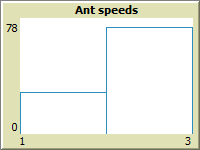
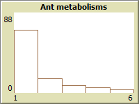

# `2-metabolismo`

Questo branch estende il progetto [`2-base`](https://github.com/Steffo99/turtle007/tree/2-base) aggiungendo nuovi parametri alle formiche del sistema.

## Ambiente

### Ricomparsa del cibo

Se attivata tramite lo switch `food-respawn`, questa feature fa ricomparire il cibo all'interno dell'ambiente dopo `food-r-*` tick (con un offset di `food-o-*` tick).

```lisp
to try-respawn-food-*
  if ticks mod food-r-* = food-o-* [
    add-food-*
  ]
end
```

_L'asterisco indica il numero della pila di cibo, da 1 a 3._

### Velocità delle formiche

Alle formiche è stato aggiunto il parametro `speed`.

```lisp
ants-own [speed]
```

Esso è inizializzato a un **numero intero casuale** tra `min-speed` (1) e `max-speed` (2) al momento di creazione della formica, e rappresenta quante volte una formica può agire in un tick.

```lisp
repeat speed [
    fd 1
    t-try-pick-up-food
    if t-try-drop-food [
        t-resupply
    ]
]
```

### Metabolismo delle formiche

Alle formiche sono stati aggiunti i parametri `metabolism` e `hunger`.

```lisp
ants-own [metabolism hunger]
```

Il parametro `hunger` rappresenta quanta "fame" ha una formica; alla creazione, le formiche partiranno con `max-hunger` (400) punti.

Ogni tick, l'`hunger` di ogni formica perde `metabolism` punti, che saranno ripristinati a `max-hunger` solo se la formica porterà una patch di cibo al formicaio.

Se una formica scende sotto 1 punto `hunger`, essa morirà, e un'altra sarà creata nel nido al suo posto con parametri diversi.

```lisp
to t-consume-food
  set hunger hunger - metabolism
  if hunger <= 0 [
    t-die
  ]
end

to t-resupply
  set hunger max-hunger
end

to t-die
  set ant-deaths ant-deaths + 1
  set ants-to-respawn ants-to-respawn + 1
  die
end

to respawn-ants
  create-ants ants-to-respawn [t-setup-ant]
  set ants-to-respawn 0
end
```

## Feedback del sistema

In aggiunta ai feedback precedenti, in questo progetto abbiamo nuovi feedback:

- <span style="background-color: lightcoral; color: darkred;">**Negativo**: Le formiche con `metabolism` troppo alto o `speed` troppo bassa per consegnare cibo al formicaio in tempo moriranno, lasciando il posto a nuove formiche con parametri diversi.</span>
- <span style="background-color: lightgreen; color: darkgreen;">**Positivo**: La casualità dei parametri delle nuove formiche favorirà quelle con parametri più adeguati all'ambiente.</span>

## Dinamica del sistema

Le formiche continueranno a portare cibo al formicaio all'infinito; le meno adeguate di esse moriranno, mentre le più adeguate continueranno a vivere.

Con il progredire dei tick, ogni parametro avrà un valore che sarà prevalente nelle formiche: esso sarà il valore ideale del parametro nell'ambiente corrente.

## Osservazioni

Con le impostazioni di default, il valore ideale del parametro `speed` sarà **2**:



Invece, il valore ideale del parametro `metabolism` sarà 1:



Si ipotizza che qualsiasi siano i valori minimi e massimi di `speed` e `metabolism`, verranno favoriti **valori più alti** di `speed` e **valori più bassi** di `metabolism`.

## Branches

Variazioni al modello sono disponibili nei branch di questo repository.

In particolare, si evidenzia il branch:

- [`2-evoluzione`](https://github.com/Steffo99/turtle007/tree/2-evoluzione), una variante di questo modello a cui viene aggiunta la possibilità per le formiche di riprodursi e passare i loro valori di `speed` e `metabolism` ai figli.
