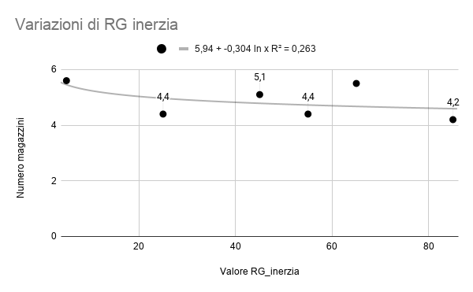
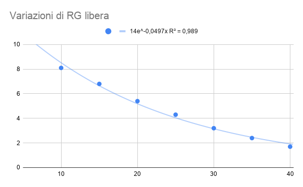
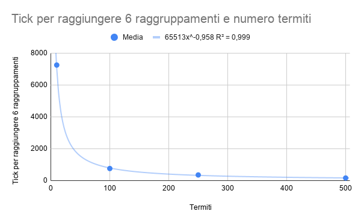
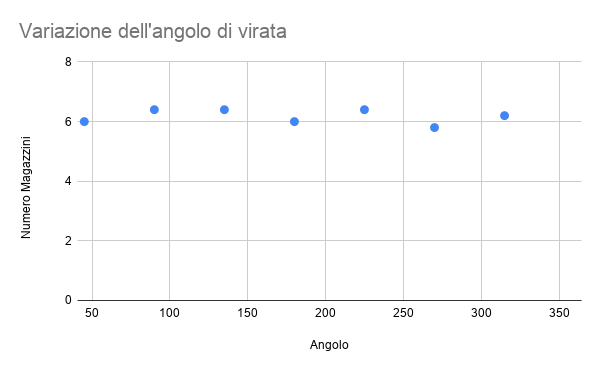

# `1-base`

## Descrizione

Il progetto complessivo consiste in una **serie di realizzazioni di un modello multiagente** e di esperimenti su di esso; ogni nuova versione del modello è più raffinata della precedente. La versione iniziale non è un sistema collettivo; la versione finale realizza un sistema collettivo i cui elementi sono capaci di evolvere e di adattarsi all’ambiente.

## Ambiente

L’ambiente è un [toroide](https://it.wikipedia.org/wiki/Toro_(geometria)) composto da 150x150 patch.

Dopo il `setup` dell'ambiente, una percentuale configurabile di patch conterrà cibo (gialle), mentre le restanti saranno vuote (nere).

### Termiti

Dopo il `setup`, nell'ambiente saranno presenti un numero configurabile di termiti.

Le termiti normalmente sono bianche, ma diventano arancioni quando trasportano cibo.

Esse (una alla volta, in ordine casuale) effettueranno ad ogni `tick` le seguenti azioni: 

1. **Ricerca**: la termite _vaga_ per l'ambiente fino a quando non incontra un pezzo di cibo, che _raccoglie_, per poi _allontanarsi_ dalla sua posizione attuale. 
    1. **Vaga**: la termite ruota di un angolo configurabile di gradi, poi avanza di un passo.
    2. **Raccoglie**: la termite rimuove il cibo dalla patch in cui si trova e inizia a trasportarlo, cambiando colore. 
    3. **Allontana**: la termite si gira in una direzione casuale, ed effettua un numero configurabile di passi in avanti detto `rg_inerzia`.
2. **Deposito**: la termite _vaga_ per l'ambiente fino a quando non trova un posto dove depositare il cibo, lo _deposita_ e poi si _allontana_ dalla sua posizione attuale.
    1. **Vaga**: la termite ruota di un angolo configurabile di gradi, poi avanza di un passo.
    2. **Deposita**: la termite inserisce il cibo nella patch in cui si trova, e smette di trasportarlo, tornando al suo colore originale.
    3. **Allontana**: la termite si gira in una direzione casuale, ed effettua un numero configurabile di passi in avanti detto `rg_libera`.

## Dinamica del sistema

Le termiti spostano ad ogni `tick` un pezzo di cibo da una patch a un'altra, che si trova ad una certa distanza dalla prima, effettuando una **unità di lavoro**.

Così facendo, le termiti raccolgono il cibo in **magazzini** progressivamente sempre più compatti e vicini tra loro, che lentamente si uniscono fino a formare un unico magazzino comprendente tutto il cibo dell'ambiente.

## Feedback del sistema

Nel sistema sono presenti due tipi di feedback:
- **Positivo**: Più grande è un magazzino, più probabilità una termite avrà di capitarci sopra ed appoggiare lì il proprio cibo, portandolo a ingrandirsi nel tempo.
- **Negativo**: Meno grande è un magazzino, meno probabilità una termite avrà di capitarci sopra ed appoggiare lì il proprio cibo, portandolo a ridursi nel tempo.

## Esperimenti

Tutti gli esperimenti sottostanti sono stati eseguiti con i parametri di default qui elencati:

- `densita_materiale`: 20
- `numero_termiti`: 100
- `rg_inerzia`: 20
- `rg_libera`: 20
- `angolo_virata`: 100

### Esperimento 1: Variazioni al valore di `rg_inerzia`

Si sono misurati i **magazzini formatosi dopo 1000 tick** al variare del parametro `rg_inerzia`.

Dai dati sperimentali emerge che il parametro non influenza particolarmente il numero di magazzini; eventuali variazioni sono da ricondursi alla casualità dello stato iniziale di questo modello.

Tentativi di interpolazione non hanno fornito nessun risultato con i dati raccolti: il best fit è stato con la curva logaritmica, avente un misero `R^2 = 0.263`.  

#### Dati sperimentali

|`rg_inerzia`| Run 1 | Run 2 | Run 3 | Run 4 | Run 5 | Run 6 | Run 7 | Run 8 | Run 9 | Run 10 | Media |
|---|---|---|---|---|---|---|---|---|---|---|---|
|5|4|	6|	6|	6|	7|	6|	6|	6|	4|	5|**5.6**|
|25|4	|5	|4	|5	|4	|5	|5	|4	|4	|4|**4.4**|
|45|6	|4	|2	|5	|4	|7	|6	|7	|4	|6|**5.1**|
|55|4	|5	|4	|5	|3	|5	|4	|4	|4	|6|**4.4**|
|65|5	|5	|5	|7	|6	|6	|5	|5	|5	|6|**5.5**|
|85|4	|4	|4	|4	|6	|5	|5	|3	|4	|3|**4.2**|

#### Grafico

### Esperimento 2: Variazioni al valore di `rg_libera` 

Si sono misurati i **magazzini formatosi dopo 1000 tick** al variare del parametro `rg_libera`.

Dai dati sperimentali emerge che il valore del parametro `rg_libera` è inversamente proporzionale al numero di magazzini creatosi dopo 1000 tick.

Probabilmente l'andamento è esponenziale: con il parametro impostato a 5 i magazzini sono ancora talmente tanti da risultare incalcolabili, ma aumentarla anche solo a 10 e li rende un numero definito.  
Interpolando con una curva esponenziale, si è ottenuto un `R^2 = 0.989`.

#### Dati sperimentali

| `rg_libera` | Run 1 | Run 2 | Run 3 | Run 4 | Run 5 | Run 6 | Run 7 | Run 8 | Run 9 | Run 10 | Media |
|---|---|---|---|---|---|---|---|---|---|---|---|
|5  | _N/D_| _N/D_| _N/D_| _N/D_| _N/D_| _N/D_| _N/D_| _N/D_| _N/D_| _N/D_|**_N/D_**|
|10	|7	|9	|9	|7	|9	|7	|8	|9	|8	|8	|**8.1**|
|15	|7	|6	|7	|7	|6	|7	|6	|8	|7	|7	|**6.8**|
|20	|5	|5	|6	|5	|5	|7	|6	|6	|4	|5	|**5.4**|
|25	|4	|5	|4	|4	|5	|4	|4	|4	|4	|5	|**4.3**|
|30	|4	|3	|3	|3	|3	|2	|3	|4	|4	|3	|**3.2**|
|35	|3	|2	|2	|2	|2	|2	|3	|3	|2	|3	|**2.4**|
|40	|1	|2	|1	|2	|1	|2	|2	|3	|2	|1	|**1.7**|

#### Grafico

### Esperimento 3: Variazioni al numero di termiti nel sistema

Si è misurato il tempo necessario perchè quantità le termiti formassero 6 raggruppamenti di cibo al variare delle quantità di termiti.

Si è ipotizzato che formare 6 raggruppamenti richieda un numero di _unità di lavoro_ costante (dipendente dalla disposizione iniziale del cibo).

Effettuando gli esperimenti, si è verificata questa ipotesi: si è notata una dipendenza inversa tra il numero di tick richiesti e il numero di termiti presenti nel modello secondo la formula `termiti * tick_richiesti = costante`

Si è riusciti a determinare il valore della costante (con un margine di errore): esso è **~79875 unità di lavoro**.

#### Dati sperimentali

| Termiti | Run 1 | Run 2 | Run 3 | Run 4 | Run 5 | Run 6 | Run 7 | Run 8 | Run 9 | Run 10 | Media tick | Media unità di lavoro |
|---|---|---|---|---|---|---|---|---|---|---|---|---|
| 10 | 7000 | 6000 | 6000 | 7500 | 6000 | 8000 | 9000 | 10000 | 6000 | 7000 | **7250** | **72500** |
| 100 | 700 | 800 | 800 | 700 | 900 | 800 | 900 | 600 | 700 | 700 | **760** | **76000** |
| 250 | 320 | 440 | 360 | 400 | 320 | 440 | 360 | 360 | 240 | 320 | **356** | **89000** |
| 500 | 180 | 160 | 120 | 120 | 180 | 200 | 160 | 240 | 160 | 120 | **164** | **82000** |
| _Media_ | | | | | | | | | | | | _**79875**_ |

#### Grafico

### Esperimento 4: Variazioni al valore `angolo_virata`

Si sono misurati i **magazzini formatosi dopo 1000 tick** al variare del parametro `angolo_virata`.

Dai dati sperimentali si nota che la variazione del numero dei magazzini è pressochè nulla; si può quindi dire che la variazione dell'angolo di virata non influenza il numero magazzini creati dalle termiti.

#### Dati sperimentali

|Angolo_virata|Valore medio magazzini| Run 1 | Run 2 | Run 3 | Run 4 | Run 5 |
|---|---|---|---|---|---|---|
|45|5	|6	|5	|6	|5	| **5.4** |
|90|5	|6	|6	|7	|6  | **6.0** |
|135|6	|7	|5	|6	|8  | **6.4** |
|180|7	|7	|6	|6	|6  | **6.4** |
|225|5	|5	|6	|7	|7  | **6.0** |
|270|6	|6	|6	|7	|7  | **6.4** |
|315|5	|6	|6	|7	|5  | **5.8** |
|360|6	|7	|6	|6	|6  | **6.2** |

#### Grafico

## Branches

Sono disponibili vari branch con variazioni a questo progetto:

- [`1-group-counter`: Aggiunge conteggio automatico dei magazzini](https://github.com/Steffo99/turtle007/tree/1-group-counter)
- [`1-efficiency-tiredness`: Aggiunge parametri di efficienza e stanchezza alle termiti](https://github.com/Steffo99/turtle007/tree/1-efficiency-tiredness)
- [`1-ticks`: Fa muovere le formiche di una sola unità per ogni tick](https://github.com/Steffo99/turtle007/tree/1-ticks)
